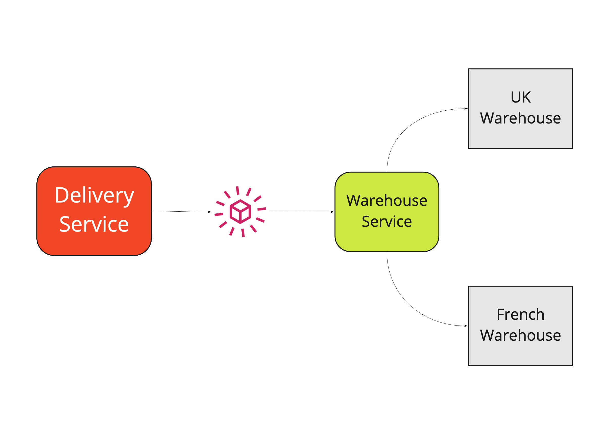

# Who am I?

My name is Bob. I'm a software architect working for Cazoo.

Fight me on twitter: @bob\_the\_mighty

Slides at github.com/bobthemighty/complex-things-small-pieces


<!--
Hi my name's Bob blah blah
-->

---
# Serverless Makes it ~~Easy~~ Less Complicated
<!--
I want to talk today about how to build complex systems from small parts. The title of my talk, apparently, is "serverless makes it easy" which happens to be a proposition that I very much doubt. In fact, I think that adopting serverless will make things _hard_ for you, at least in the short term, because you have to learn a whole new paradigm, and rearchitect your systems, and hire or train people who can build things in this new way. None of that is cheap or easy, but I think it's worth it, in the longer term, because it helps us to build complex things, not complicated ones.

What do we mean by "complex"? It's a word that's often misused, I think, as a synonym for "complicated", but these two words have different meanings, and understanding the diffrence is important to software engineering.
-->

<style>
footer { width: 100%; color: #000; text-align: center; background: rgba(255, 255, 255, 0.2) }
footer a { color: #000 }
section: { vertical-align: top }
</style>

---
## Simple vs Complex

<!-- _footer: https://commons.wikimedia.org/wiki/File:CONWAY-3_Glider_Gun_Glider_Eater.gif -->


<!--
If a thing is complex then it comprises many interrelated parts. A complex thing is _intricate_. The parts of a complex thing have connections between them that aren't always obvious. In mathematics, a complex system is one where we can't infer behaviour from surface properties. Complex systems include mindbogglingly large things, liek the Earth's climate, and apparently simple things like Conway's game of life.

-->

---
## What is simple?

<!--
A simple thing has very few parts, and the behviour is obvious from the surface properties. For example, a hammer is a simple machine. It's hard to get much simpler and still have a machine that has a single recognisable purpose. A hammer is literally a lump of metal on a stick. 
-->


---
## What is complex?

<!--
By comparison, the Antikythera mechanism is a complex machine. This is a reproduction, but they found the original buried in the sediment under the sea. It was manufactured 2000 years ago by the ancient greeks, and it's a computer that forecasts the movements of the planets and the moon and eclipses.

If I were out walking, and I found the head of a hammer, I could immediately grasp what it is. Even if I'd never seen a hammer before, I could quickly understand that it's a heavy piece of metal suitable for striking other objects. If, however, I found a single cog, or lever from the antikythera mechanism, I would stand no chance at all of guessing the behaviour of the system that included it.
-->

.jpg)
<!-- _footer: Gts-tg / CC BY-SA (https://creativecommons.org/licenses/by-sa/4.0) -->

---
## What is complicated?


<!--
What's the difference between complex and complicated? A thing that's complicated has many parts and is hard to understand. Complications are usually imposed from the outside rather than being intrinsic. A complex thing is complex because of what it is, but a complicated thing is usually complicated because _people_ got involved. 

Chess, for example, is a complicated game. In chess you've got 6 different pieces that all move in different ways; pawns move an extra space on their first turn; there's a magic castling thing where the king can teleport across the board; if your pawn reaches the other side, they become queen; and so on.

It's easy to imagine a version of chess where one of these rules is different, where the bishop and the rook are swapped over, for example, or where pawns all move like rooks so that the opening phase is just a series of made suicidal charges across the board. These games would still recognisably be chess, even though the strategy might be quite different. That's because the rules of chess are complicated and arbitrary.
-->

---

<!--
By contrast, Go is a complex game. In Go, players take turns to put stones on the board, anywhere they like. IF your stones are completely surrounded, they're captured, and your move isn't allowed to return the board to its previous state to avoid infinite cycles. At the end of the game, the player with the most stones on the board, plus the stones they captured, is the winner. That's it, those are the rules. You can't just remove one of those rules, or say that stones are allowed to move around, or that pieces can't be captured any more, or the game _won't be Go_ any more. Despite the apparently simple rules, Go is an extraordinarily complex system made up of these few small components.

Now people tell us that we should avoid complexity, right? That we should strive to achieve simplicity in our code and our systems, but my experience is that the complexity always has to go _somewhere_.
-->
## Complex vs Complicated


<!-- _footer: Gts-tg / CC BY-SA 3.0 (https://creativecommons.org/licenses/by-sa/3.0) -->

---
<!--
I wrote a book about this, where we talk about how to build systems that exhibit complex behaviour, from small components that are each locally simple. At the time I was working for MADE.com, who are an e-commerce company selling furniture online. Here's an example of a complex thing:
-->

# Buy my book!


---
<!--
When you go to MADE's website and you want to buy a lamp, two cushions, and an armchair, we have to arrange for someone to bring those things to your house, and we have to charge you money for the privilege. Why is that difficult?
-->


---


<!--
Well, because it turns out that shipping things is complicated. For small things, like spoons or mugs it's cheaper to send them with the post office, but the post office won't take large things like lamps or armchairs. For middle-sized things like lamps, it's best to send them with a courier like DHL and, if you're smart, you can fit some cushions and forks and whatnot into the same box, so we save some money, but they won't take armchairs because you need two people to lift those. Some middle-sized items like curtain rails are really long and skinny, so DHL won't take those either, and you have to send those with a different courier that costs more money. For really big things, like dining tables or sofas, you need a two-man delivery service and they don't touch forks or mugs, but might take lamps.  This is a problem that you can't solve with a hammer, you need an antikythera mechanism.

When I started at MADE we had a guy, we'll call him Paul, because that's his name, whose job was to look at the list of things customers had bought every day in a spreadsheet and apply his powers of reasoning to solve this logic puzzle: how many trucks do we need to order from all these different delivery companies in order to efficiently dispatch all these items?
-->

---
```
class LongerThan (Specification):

   def __init__(self, max_length):
      self.max_length = max_length
      
   def matches (self, product):
      return product.max_dimension > self.max_length
      
      
class HeavierThan(Specification):

    def __init__(self, max_mass):
        self.max_mass = max_mass
        
    def matches (self, product):
        return product.mass > self.max_mass
      
longer_than_1_metre = LongerThan(100)
heavier_than_5_kilos = HeavierThan(5000)
```
<!--
The trouble, of course, is that you can't scale Paul and so you have to put the complexity back into a computer program so we can sell a million items of furniture instead of a hundred.

You can model this complexity by composing simple things. We used a design pattern called the Specification pattern to write a bunch of rules like "is longer than 1 metre" or "weighs more than 5 kilos" and we could compose these rules together to produce complex rules. 
-->
---
```
can_ship_with_post_office = 
  max_dimension_smaller_than(30)
  and lighter_than(5000)
  and not_explosive()
```

```
all(can_ship_with_post_office) or not any(requires_two_man_delivery)
```

<!--
For example, maybe we can ship an item with the post office so long as its less than 30 cm in length and weighs less than a kilo. Also, it can't be explosive, or contain hman body parts or whatever. It's easy for us to compose that rule from smaller pieces.
This, I think, is the essence of software engineering. We want to provide complex behaviour without complicating our code or our execution environment.
-->

---
<!-- _header: "Deploying code is complicated" -->

<!--
This gives me a nice segue into Serverless because the trouble with this nice clean code is that at some point we have to _deploy_ it. 

Urgh. Production. Where concepts go to die. This simple application, with its clever model, and its unit tests and its domain driven design,  -->


---
<!-- _header: "Deploying code is complicated" -->

<!--had to run under a web server, so we used Flask. -->


---
<!-- _header: "Deploying code is complicated" -->

<!-- Flask sucks at handling lots of connections unless you run it with nginx, so we bundled both of those up in a Docker image, which had Alpine installed. -->


---
<!-- _header: "Deploying code is complicated" -->

<!-- Alpine is amazing, but there were problems with some dependencies which meant we had to run our own alpine package repository, and our own docker registry. -->


---
<!-- _header: "Deploying code is complicated" -->

<!--
We deployed our docker images to a cluster of machines running Hashicorp Nomad, and set up Consul for distributed configuration, and Vault for secrets management.  -->


---
<!-- _header: "Deploying code is complicated" -->

<!-- We routed traffic across the cluster by running Fabio, and the whole thing was deployed and managed by Ansible.
-->


---
<!-- _header: "Deploying code is complicated" -->

<!--
Every last piece of that is a complication. It is imposed from the outside on our view of the world. It is unwelcome. The only thing I really care about as an engineer is that little green box.
-->


<!--
My position, then, is not that serverless makes things easy, but that serverless makes things less _complicated_ and that frees us up to focus on the essential complexity of the problem we're trying to solve.
-->


---
<!-- _header: "Events for composing systems" -->

<!--
A key technique I've used over the last decade or so is "Event driven architecture". In an event-driven architecture, we build small objects that handle messages.  -->


---

<!--
We build these small pieces of code and we connect them together using "Events". An event is a bit of data, let's say we use JSON to encode it, that we publish from a producer, and handle in an unknown number of consumers. This helps us to divide up the work, so that each component can be locally simple, but the overall behaviour can be complex. The important characteristic is that the producer doesn't know anything about the subscribers, so it can just focus on its own simple logic and let everyone else worry about their bit.
-->

<!-- _header: "Events for composing systems" -->


---

<!--
When I first did this, we used RabbitMQ to move events around, but it turns out that RabbitMQ is hard to distribute across data centres. It works really well when all of your servers are on a single rack, but in 2020 everybody runs in the cloud. Trying to run a highly available cluster of RabbitMQ nodes in the cloud is _really complicated_. You do not want to have a split brain outage on your messaging infrastructure. That will be very bad, and you will have a very bad time. This helpful diagram explains how to run an HA federated cluster of RabbitMq machines. This is a beautiful diagram, but it's just too complicated in order to make our simple topology work.
-->


---
<!--
Now I use EventBridge.

EventBridge is a messaging platform from AWS built for this kind of publish-subscribe architecture, and I actually have a crush on it. It solves a complicated problem - moving messages around in a scalable, fault tolerant way - and presents a very simple interface. 

-->


---
<!--
A typical use case might be, for example, that when our delivery service figures out how best to deliver your cushions and your curtain rail and your chaise longue, it needs to tell the guys at the Warehouse what to do. This is _complicated_ because your UK warehouse wants you to send them instructions over FTP in a CSV format, but your French Warehouse wants you to send XML to an HTTP endpoint, so you have to take your delivery decisions and translate them to the appropriate formats for each country. Using events means we can keep those things separate, so that each piece is locally simple.

--->



---
<!--
We connect our delivery system and our warehouse system with an eventbridge rule that looks like this. It just says please tell me any time you see a "Delivery Method Calculated" message from the delivery service.
-->

```
{
  "source": "my-delivery-service",
  "detail-type": "DeliveryMethodCalculated"
}
```
---
<!--
Using EventBridge we can do more interesting things, though. For example, we can write rules that match the content of a message. I think you need to be careful not to make things _complicated_ by getting too clever here, but in this example we're subscribing to receive consignment created messages, but only if the delivery country is France. I can use rules like these to route my messages to the right handlers, and now each of these handlers can be very simple, because it's focused on a smaller use case.
-->


```
{
  "source": "my-delivery-service",
  "detail-type": "DeliveryMethodCalculated",
  "detail": { 
    "address": { 
      "country": "FR"
    }
  }
}
```
---

<!--
EventBridge also supports scheduled events, so I can use it to trigger an event every day, or every 5 minutes or whatever. I frequently see teams that deploy an entire server into their production environment just to handle cron. What if you could get rid of cron from your machines, and have it be available serverlessly? Eventbridge means that we can run this small piece of code that we care about on a schedule without any infrastructure at all.
-->


---

<!-- One more example and then I'm done rambling about complexity. I've been a software engineer for about 20 years, almost all of that building web applications of one stripe or another. One of the jobs I hate the most is file uploads, because it seems like such a simple thing to do, and yet it's always such a pain in the backside. -->


* Generate a thumbnail image
* What happens if the server runs out of disk?
* Update the database after the doc is uploaded
* Notify the user after their doc is processed

<!-- it's a pain in the backside because there are all these complicating factors. HTTP Requests time out, so ideally you'll chunk that upload in case it times out halfway through a 1Gb file, but that means you need to put the file together again at the end, and you'll need to keep the chunks somewhere. You don't want to write them to network attached storage, because that makes your upload really slow, but you also don't want to write them to the local disk because it might get full, or your resume might happen on a different physical server, and just talking about it, honestly, is giving me the heebie jeebies. -->

---


<!-- Here's how we could handle those serverlessly. For a start we can run API Gateway. We can delegate questions about load balancing and managing authentication and all that rubbish to this piece of managed infrastructure so that we don't have to think about it. Straight away we can sidestep a whole bunch of complicated nonsense with this one decision. -->

---


<!-- We're going to call this API and ask it to generate us an upload URI. Our API Gateway invokes a lambda function that calls S3 on our behalf and creates a pre-signed URL. This is URL that will allow us to upload exactly one file directly to an S3 bucket. We give it back to the end user and then they can interact with the bucket. -->

---


<!-- Our plucky user can upload their files straight into the S3 bucket, and we can use the officially supported libraries to do so. That means we get nice things like splitting large files. If we need to store attributes with the file - like where a photo was taken, or the name of an author - we can include user metadata in the original presigned link, so that it gets baked into the file in S3. When the upload is finished, we fire an eventbridge event through Cloudtrail. That triggers another lambda that takes all our user metadata and updates the database. -->

---


<!-- 

Lastly, when we write the file into the database, we can use a dynamo change stream to trigger any additional processing that we need to do - virus scanning, or thumbnail generation for example. We also use this to trigger the Notify User lambda, which - in turn - notifies the user that their file has been updated via a websocket.

Now all of this is _complex_ - this is a highly complex system with lots of small moving parts, but each one of these green boxes is focused on doing just one very simple task, and all of the wiring and quality of service attributes are delegated to AWS. We don't have to build complicated systems to handle complex requirements. Instead we can build small simple pieces, and compose them.

-->

---

# Thanks!

(also, we're hiring)
